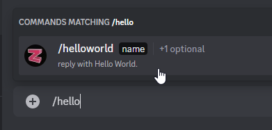
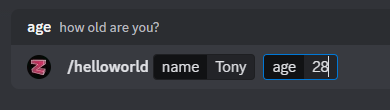
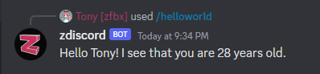
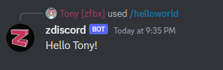

# Creating a Command

\
Creating your own commands for zdiscord is a fairly simple process. Let's walk through the steps in creating your own command.

### The Basics

Create a new javascript file under `/server/commands` with the name of your command (all lowercase, no spaces). in this case we'll make a basic `helloworld.js`

Paste the following command base into the file you created. this is everything **required** for a command to work properly:

```javascript
module.exports = class cmd extends Command {
    constructor(file) {
        super("helloworld", file, {
            description: "reply with Hello World.",
            // This is where you would add role or options (shown below)
        });
    }
    
    async run(interaction, args) {
        return interaction.reply("Hello World");
    }
};
```

If you wanted to make it so only mod, admin or god could run your command you'd add the following line under your description line:

```javascript
role: "mod", // can also be "admin" or "god"
```

If you wanted to be able to accept input from the person submitting the command like an age and a name, you'd add the following:

```javascript
options: [
    {
            name: "name",
            description: "What is your name?",
            required: true, // true means this will be required
            type: djs.ApplicationCommandOptionType.String, // for text
    },
    {
            name: "age",
            description: "how old are you?",
            required: false, // false means this will be optional
            type: djs.ApplicationCommandOptionType.Integer, // for number only
    },
],
```

Now with these new options available you'll want to make use of them in the `run` function. Here's an updated run function that makes use of the options above:

```javascript
async run(interaction, args) {
    let message = `Hello ${args.name}!`;
    if (args.age) {
        message += ` I see that you are ${args.age} years old`;
    }
    return interaction.reply(message);
}
```

<details>

<summary>The final product</summary>

```javascript
module.exports = class cmd extends Command {
    constructor(file) {
        super("helloworld", file, {
            description: "reply with Hello World.",
            role: "mod",
            options: [
                {
                    name: "name",
                    description: "What is your name?",
                    required: true, // true means this will be required
                    type: djs.ApplicationCommandOptionType.String, // for text
                },
                {
                    name: "age",
                    description: "how old are you?",
                    required: false, // false means this will be optional
                    type: djs.ApplicationCommandOptionType.Integer, // for number only
                },
            ],
        });
    }

    async run(interaction, args) {
        let message = `Hello ${args.name}!`;
        if (args.age) {
            message += ` I see that you are ${args.age} years old.`;
        }
        return interaction.reply(message);
    }
};
```

</details>

### The results!

If you followed along and did everything correctly, starting your bot you should now have a new command when you type `/` in discord like so:

<div>

<figure><figcaption><p>typing /hello should suggest it</p></figcaption></figure>

 

<figure><figcaption><p>Fill in the name and age</p></figcaption></figure>

</div>

And the reply it gives should look like the following!

<div>

<figure><figcaption><p>The reply zdiscord will give</p></figcaption></figure>

 

<figure><figcaption><p>The reply if you don't give an age</p></figcaption></figure>

</div>

### Additional resources

If you need further guidance these links should help:\
[discord.js guide](https://discordjs.guide/#before-you-begin) - Great for beginners to discord.js\
[discord.js docs](https://discord.js.org/#/docs/main/stable/general/welcome) - Has almost everything you need to know\
[discord.com command docs](https://discord.com/developers/docs/interactions/application-commands) - specific details about how things work\
[FiveM server functions for JS](https://docs.fivem.net/docs/scripting-reference/runtimes/javascript/server-functions/) - Everything you can do with FiveM from a command\
**This resource itself** - Honestly there's so many features and practices being used actively here in commands and utils that you can take note from or in many cases just copy and paste and use so have at it and don't be afraid to break things to learn more.. as long as you're not working on a live server while you're breaking things..
