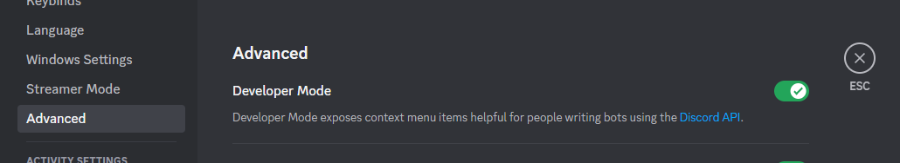
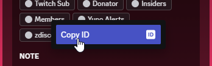
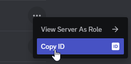
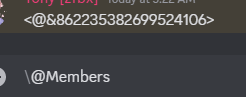

# Getting a discord ID

Getting an ID in discord is actually quite easy. First thing you need to do is enable "Developer Mode" which sounds scary but it simply adds "Copy ID" to your right click menu.&#x20;

### Enable Developer Mode

Go into your **discord settings (Gear Icon) > advanced > Developer Mode** then Save Changes.

<figure><figcaption>
Enabled Developer Mode for Discord
</figcaption></figure>

That's it. You now have developer mode enabled and when you right click users, roles, messages and server icons you'll get the option to "Copy ID" at the bottom. When clicked it should copy a \~20 digit number which will be the ID of that item.

### Getting your Server / Guild ID

With Developer Mode enabled, Right click either the server icon on the left side of your discord OR the server name at the top left when you're in the  window and click "Copy ID" 

On mobile: You can long press/hold the server icon and click "More Options" then scroll to the bottom and "Copy ID"

### Getting a Role ID

There's a few ways to get a role id

#### Method 1

Add the role to yourself or someone else in the server, click their name to bring up the mini profile with their list of roles and right click on the role you want the id of and "Copy ID"&#x20;

<figure><figcaption></figcaption></figure>

#### Method 2

Go into Server Settings > Roles and click the `...` icon OR right click the role name and "Copy ID"

<figure><figcaption></figcaption></figure>

#### Method 3

Typing in the server somewhere do an @ mention of the role you want the ID of, before sending it though go to just before the @ mention and type a `\` character then send the message, it should convert the mentioned role into a string of characters starting with `<@&` and ending with `>`, what's between these characters is the id for the role.

<figure><figcaption>
Top: Sent message Bottom: Typed Message
</figcaption></figure>

### Getting a User ID

This one is the easiest, with Developer Mode enabled, right click someone's username from either in chat or from the right side list and "Copy ID".

On mobile: Click a users profile picture then click the `...` in the top right of the mini profile window to get the "Copy ID" button.
